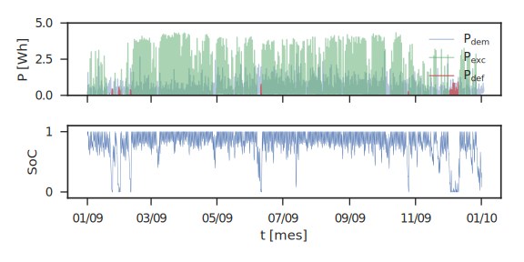
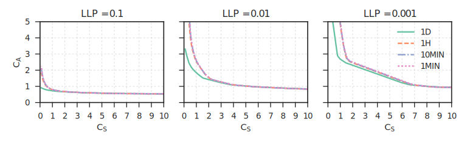

# Standalone PV Sizing via LLP (Loss of Load Probability)

Design framework for sizing off-grid photovoltaic systems using LLP-based isoreliability curves. The approach balances reliability and cost to identify an optimal region of array capacity and storage size.

## Overview
- Purpose: compute LLP and isoreliability lines from measured solar irradiation and real household load, and use them to guide system sizing.
- Scope: sensitivity to sampling frequency, climate variability (multi‑year history), and consumption mode (constant vs variable profiles).
- Outcome: actionable sizing guidance with reliability thresholds and cost-aware trade‑offs.

### System Dynamics & Energy Balance
To understand sizing requirements, the framework simulates the energy balance and battery behavior under real demand and measured resource.

   

Figure 1. Time-series view showing power balance (demand, surplus generation, deficits) and the resulting battery State of Charge (SoC) over a monthly horizon.

## Key Highlights
- Isoreliability curves map combinations of collector size (CS) and accumulator size (CA) that achieve the same reliability level.
- Optimal sizing region identified in the low‑storage / high‑production quadrant when considering multi-dimensional cost (energy + economic).
- Reliability limit of practical use near 99% (LLP = 0.01) given interannual climate variability of the dataset.
- Sampling frequency matters: hourly (or finer) series preserve reliability estimation; daily series are not recommended under current operating assumptions.
- Consumption mode impacts results; the framework is sensitive to variable vs constant demand profiles.
- Comparative assessment vs analytical and semi‑analytical methods shows alignment in high-storage regimes and divergence in the region of interest.

## Methodology
1. Build LLP estimator from experimental global solar irradiation (MeteoGalicia) and real household consumption (off‑grid PV in Vedra).
2. Generate isoreliability curves across a grid of (CS, CA) and target reliability levels.
3. Perform sensitivity analyses:
   - Temporal frequency (daily vs hourly or sub‑hourly)
   - Climate variability (≈ 9‑year historical window)
   - Consumption modes (constant / variable at different frequencies)
4. Define a simple multi‑dimensional cost surface to highlight the efficient frontier and the optimal region.
5. Compare against selected analytical and semi‑analytical sizing methods from the literature.

## Data & Assumptions
- Solar resource: multi‑year measured global irradiation (regional observatory).
- Load: real, isolated single‑family household with PV supply.
- Reliability definition: probability of unmet load over the horizon (LLP); target band up to ~99%.

## Results (Executive Summary)
- ~46% potential cost reduction achievable by jointly optimizing array and storage while maintaining comfort and reliability levels.
- Robust region of interest characterized by higher production and lower storage versus traditional rules‑of‑thumb.
- Practical upper limit for the estimator found near LLP = 0.01 under observed climate variability.

### Isoreliability Curves & Design Charts
The core output is a set of charts to select cost‑effective (CS, CA) pairs at a given reliability target.

   

Figure 2. Isoreliability curves in the CS–CA plane. As required reliability increases (lower LLP), curves shift upward, demanding more storage and/or generation. Daily sampling deviates from sub‑hourly models, highlighting the need for high‑resolution data.

## Practical Use Cases
- Greenfield design for new standalone PV systems.
- Retrofit, optimization, or repowering of existing off‑grid installations.

## Data Engineering & Compute
- Data acquisition: automated queries/web scraping to MeteoGalicia to assemble multi‑year, high‑resolution irradiation time series; cleaning and quality checks to ensure continuity and consistency.
- Compute at scale: full design sweeps (CS, CA, reliability targets, sampling frequencies) executed on the High‑Performance Computing infrastructure at CESGA; batch jobs enable parallel simulation scenarios and reproducible runs.
- Artifacts: cached intermediate datasets and generated figures for rapid exploration and reporting.

## Tech Notes
- Tools: Python (NumPy, Pandas, Matplotlib/Seaborn or Plotly).
- Workflow: parameter sweeps orchestrated as batch jobs on HPC; notebooks and scripts for exploratory analysis and report‑ready charts.
- Deliverables: reliability maps (CS vs CA), sensitivity plots, and cost trade‑off visuals suitable for reports.

## Limitations & Next Steps
- Data availability: conclusions calibrated to regional resource and a specific load profile; portability requires re‑estimation.
- Future work: broaden datasets, refine cost models, and package the estimator into a small CLI/API for repeatable sizing studies.
