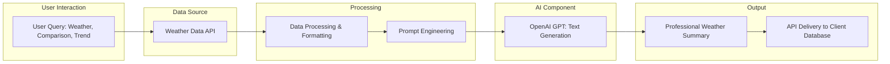

# Autonomous LLM Meteorological Agent

## 🏗 System Architecture

## 🔍 Overview

This project implements an autonomous agent that generates professional, human-readable weather reports from raw meteorological data. It combines real-time weather API integration with generative AI (OpenAI GPT) to deliver concise, actionable summaries for operational and business use.

### **Workflow**
1. **API Integration:** Securely connects to external weather data APIs to fetch hourly meteorological variables (temperature, precipitation, etc.).
2. **Data Processing:** Cleans and formats weather data for prompt engineering and advanced queries.
3. **Text Generation:** Uses OpenAI GPT to generate professional weather summaries, comparisons between locations or time periods, and trend analyses based on user queries.
4. **Delivery:** Results are delivered to client databases via API for integration into dashboards or automated workflows.

## 🎯 Impact

* **Challenge:** Raw meteorological data is complex and not easily accessible for emergency teams and decision makers.
* **Solution:** The agent translates complex atmospheric data into clear, actionable reports, facilitating communication and decision-making in critical situations.
* **Application:** Used by civil protection and emergency management teams to obtain fast, understandable weather summaries during adverse events.

## 🛠 Tech Stack

* **API Integration:** requests, dotenv
* **Data Processing:** numpy, pandas, xarray
* **Generative AI:** OpenAI GPT (via openai-python)
* **Deployment:** Python scripts, Jupyter Notebooks
* **Formats:** JSON, ENV

## 📡 Results Delivery

Weather summaries are delivered directly to client databases via secure API integration. No visual plots or images are stored in this repository; all outputs are programmatically accessible for operational use.

## Example Output

> "Today’s weather in Santiago de Compostela: Temperatures ranged from 4.2°C to 15.8°C with intermittent showers. Expect mild and variable conditions throughout the day."

> "Comparison: Santiago de Compostela experienced higher rainfall and cooler temperatures than Madrid this week."

> "Trend: Over the past month, Santiago de Compostela has seen a gradual increase in daily average temperature, with precipitation remaining stable."

**Note:** This repository is for technical demonstration and does not include sensitive data or proprietary code.
