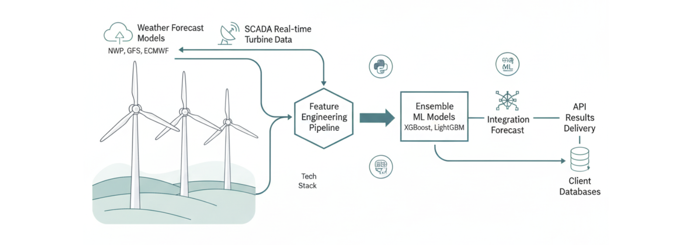
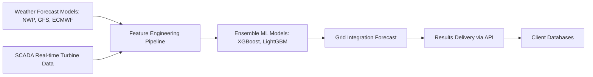

# Wind Energy Production Forecasting

## 🏗 System Architecture

        

## 🔍 Overview

This project delivers a robust pipeline for wind energy production forecasting, integrating meteorological forecasts, real-time SCADA data, and advanced machine learning. The solution is designed for operational efficiency, grid integration, and business impact in renewable energy.

### **Workflow**
1. **Data Ingestion:** Collects weather forecasts (GRIB/NetCDF) and real-time turbine data (SCADA).
2. **Feature Engineering:** Extracts meteorological, temporal, and turbine-specific features, including wake effects and terrain corrections.
3. **Modeling:** Trains ensemble models (XGBoost, LightGBM) with time-series cross-validation for robust forecasting.
4. **Results Delivery:** Forecast outputs are delivered directly to client databases via secure API integration.

## 🎯 Impact

* **Challenge:** Variability in wind power production makes operational planning and maintenance scheduling difficult.
* **Solution:** The system enables anticipation of production valleys and optimal scheduling of maintenance tasks, improving operational efficiency and grid integration.
* **Application:** Used to coordinate maintenance teams and optimize wind asset availability, supporting data-driven decision making.

## 🛠 Tech Stack

* **Machine Learning:** scikit-learn, XGBoost, LightGBM
* **Data Processing:** pandas, numpy, pyarrow
* **Visualization:** matplotlib, seaborn, mermaid
* **GIS & Terrain:** QGIS, rasterio
* **Formats:** GRIB, NetCDF, Parquet

## 📡 Results Delivery

Forecast results are delivered directly to client databases via secure API integration. No visual plots or images are stored in this repository; all outputs are programmatically accessible for operational use.

**Note:** This repository is for technical demonstration and does not include sensitive data or proprietary code.
